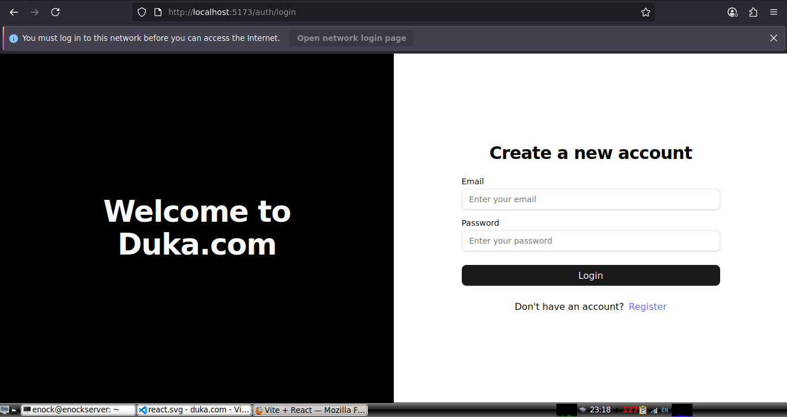

# 🛒 Duka - Monolithic MERN Stack Ecommerce App  

A full-featured **Ecommerce platform** built with the **MERN stack (MongoDB, Express, React, Node.js)**.  
Includes authentication, product management, shopping cart, orders, payment integration, and mailing service.  

🔗 **[Live Demo](https://duka-ecommerce-app.vercel.app/)**  

**NOTE**: This application is still on active development and testing stages, it will be live soon, stay updated.

---

## ✨ Features  

- 🔐 **Authentication & Authorization** (JWT, role-based: admin & customer)  
- 👤 **User Management** (register, login, profile, order history)  
- 🛍️ **Product Management** (CRUD for products, categories, inventory)  
- 🛒 **Shopping Cart & Checkout**  
- 💳 **Payment Integration** (Stripe, PayPal, or M-Pesa – configurable)  
- 📦 **Order Management** (create, track, update order status)  
- 📱 **Responsive UI** (mobile & desktop friendly)  
- 🌐 **RESTful API** with secure routes  
- 📊 **Admin Dashboard** for managing products, users & system performance  

---

## 🛠 Tech Stack  

**Frontend**  
- React (Redux, hooks, state management)  
- React Router  
- Axios  
- Shadcn for consistent UI  

**Backend**  
- Node.js + Express.js  
- MongoDB + Mongoose  
- JWT Authentication  
- REST APIs  

**Other Tools**  
- Cloudinary / AWS S3 (image uploads)  
- Multer  
- Stripe, PayPal, M-Pesa SDK  
- bcryptjs (password hashing)  
- dotenv (environment variables)  
- ESLint, Prettier, TailwindCSS  

---

## 📂 Project Structure  
```bash
ecommerce-app/
├── api
│   ├── config
│   │   └── db.js
│   ├── models
│   │   └── User.js
│   ├── package.json
│   ├── package-lock.json
│   ├── routes
│   │   └── auth-route.js
│   ├── schemas
│   │   └── UserSchema.js
│   ├── server.js
│   ├── services
│   │   ├── auth-service.js
│   │   └── token-service.js
│   └── utils
│       └── auth-validators
│           ├── loginValidator.js
│           └── registerValidator.js
├── client
│   ├── axios.js
│   ├── components.json
│   ├── eslint.config.js
│   ├── index.html
│   ├── jsconfig.app.json
│   ├── jsconfig.json
│   ├── package.json
│   ├── package-lock.json
│   ├── public
│   │   ├── auth-login.png
│   │   └── vite.svg
│   ├── README.md
│   ├── src
│   │   ├── App.css
│   │   ├── App.jsx
│   │   ├── assets
│   │   │   ├── images
│   │   │   └── react.svg
│   │   ├── components
│   │   │   ├── admin-view
│   │   │   ├── auth
│   │   │   ├── common
│   │   │   ├── guest-view
│   │   │   ├── shopping-view
│   │   │   └── ui
│   │   ├── config
│   │   │   └── index.js
│   │   ├── contexts
│   │   │   ├── auth
│   │   │   └── products
│   │   ├── custom_hooks
│   │   │   └── useAuth.jsx
│   │   ├── index.css
│   │   ├── lib
│   │   │   └── utils.js
│   │   ├── main.jsx
│   │   ├── pages
│   │   │   ├── admin-view
│   │   │   ├── auth
│   │   │   ├── guest-view
│   │   │   ├── not-found
│   │   │   └── shopping-view
│   │   └── store
│   │       ├── authSlice.js
│   │       └── store.js
│   ├── tailwind.config.js
│   └── vite.config.js
└── README.md
```

**NOTE:** Plese note that the above tree directory structure is truncated at level 4 deep and ignores gitignored files

Generated from runing the following command on bash terminal
```bash
tree --gitignore -L 4
```
---

## ⚙️ Installation & Setup

```bash
# 1️. Clone the Repo  
git clone https://github.com/EnockYator/duka-ecommerce-app.git
cd duka-ecommerce-app

# 2️. Install Dependencies  

# Backend
cd api
npm install  

# Frontend
cd ../client
npm install  

# 3️. Configure Environment Variables  
# Inside /api/.env

PORT=5000
MONGO_URI=your_mongodb_connection_string
ACCESS_TOKEN_SECRET=your_access_token_secret
REFRESH_TOKEN_SECRET=your_refresh_token_secret
STRIPE_SECRET_KEY=your_stripe_key 
PAYPAL_CLIENT_ID=your_paypal_id   

# 4️. Run the App  

# Run backend
cd api
npm run dev  

# Run frontend
cd client
npm start  
```

App will be available at:

    🌍 Frontend → http://localhost:5173

    🔗 Backend API → http://localhost:5000/api

---

## 📸 Snapshots

Home Page


Login Page



---

## 📡 API Endpoints

The following are some of the api endpoints.

**NOTE**: The app contains so many endpoints, each with a specific funtion.

|Method	| Endpoint           | Description                 |
|:------|:------------------:|:----------------------------|
|POST	| /api/auth/register | Register new user           | 
|POST	| /api/auth/login	 | Login user & get token      |
|GET	| /api/products	     | Get all products            |
|POST	| /api/products	     | Add new product (Admin)     |
|GET	| /api/orders/:id	 | Get order by ID             |

---

## 🚀 Deployment

    Frontend: Deployed on Vercel

    Backend: Deployed on Render

    Database: MongoDB Atlas

---

## 👨‍💻 Author

Enock Yator
🔗 [GitHub](https://github.com/EnockYator)
